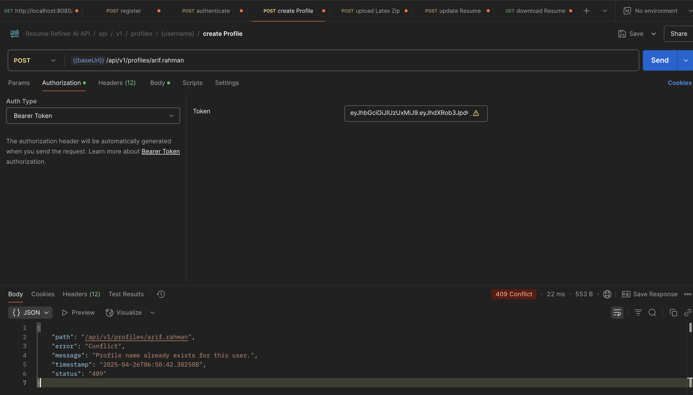

# Resume Refiner AI
AI-powered platform to optimize and tailor resumes for job seekers.

**CS489 Final Project**

## Table of Contents

1. [Software Requirements](#1-software-requirements)
2. [Domain Modeling](#2-domain-modeling)
3. [Tech Stack Explanation](#3-tech-stack-explanation)
4. [Architecture Design](#4-architecture-design)
5. [ER Diagram](#5-er-diagram)
6. [DTO Usage & Validation](#6-dto-usage--validation)
7. [Data Persistence (JPA)](#7-data-persistence-jpa)
8. [RESTful API Design](#8-restful-api-design)
9. [Global Exception Handling](#9-global-exception-handling)
10. [Paging Implementation](#10-paging-implementation)
11. [Security Implementation](#11-security-implementation)
12. [Software Testing](#12-software-testing)
13. [Dockerization](#13-dockerization)
14. [Cloud Deployment](#14-cloud-deployment)
15. [README & Screenshots](#15-readme--screenshots)
16. [Presentation & Q&A](#16-presentation--qa)
17. [Front End (Optional, Bonus point)](#17-front-end-optional-bonus-point)


---

## 1. Software Requirements

**Objective:**  
When searching for a job, it’s essential to tailor your resume for each job description. Resume Refiner AI allows users to register, create multiple resume profiles (e.g., Full Stack Java, React Frontend, Node.js Backend), and tailor each resume to a specific job description using OpenAI’s API and LaTeX-to-PDF generation.

**Key Features:**
- User registration and JWT authentication
- Multiple profiles per user, each with a tailored resume
- Upload LaTeX resume templates as ZIP files
- AI-powered resume section rewriting based on job descriptions
- PDF resume generation via Dockerized LaTeX
- RESTful API with Swagger documentation

---

## 2. Domain Modeling

- **Entities:** User, Profile, Job
- **Relationships:**
    - User (1) - (M) Profile
    - Profile (M) - (1) User
    - Each Profile has a LaTeX-based resume

---

## 3. Tech Stack Explanation

- **Backend:** Spring Boot 3, Spring Security (JWT), JPA/Hibernate
- **Database:** PostgreSQL
- **AI Integration:** OpenAI API (GPT-4)
- **PDF Generation:** Dockerized LaTeX compiler
- **API Docs:** Swagger (springdoc-openapi)
- **Build/Deploy:** Maven, Docker, Docker Compose

---

## 4. Architecture Design

- **Layers:**
    - Controller → Service → Repository
    - DTOs for API requests/responses
    - MapStruct for entity-DTO mapping

- **Separation of Concerns:**
  - Security, validation, and exception handling are modularized


```
resume-refiner-ai/
├── src/
│   ├── main/
│   │   ├── java/
│   │   │   └── edu/
│   │   │       └── miu/
│   │   │           └── cs/
│   │   │               └── cs489/
│   │   │                   └── resumerefinerai/
│   │   │                       ├── ResumeRefinerAiApplication.java   # Main Spring Boot class
│   │   │                       ├── config/                          # Security, JWT, OpenAPI config
│   │   │                       ├── controller/                      # REST controllers (Profile, Resume, etc.)
│   │   │                       ├── auth/
│   │   │                       │   ├── controller/                  # Auth endpoints
│   │   │                       │   ├── dto/                         # Auth DTOs
│   │   │                       │   │   ├── request/
│   │   │                       │   │   └── response/
│   │   │                       │   ├── repository/                  # UserRepository
│   │   │                       │   ├── service/                     # AuthenticationService
│   │   │                       │   ├── user/                        # User, Role, Permission entities
│   │   │                       ├── dto/
│   │   │                       │   ├── request/
│   │   │                       │   └── response/
│   │   │                       ├── exception/                       # Custom exceptions, GlobalExceptionHandler
│   │   │                       ├── mapper/                          # MapStruct mappers
│   │   │                       ├── model/                           # JPA entities (Profile, Job, etc.)
│   │   │                       ├── repository/                      # JPA repositories (ProfileRepository, JobRepository)
│   │   │                       ├── secured/                         # Secured admin/member controllers
│   │   │                       ├── service/                         # Business logic (ProfileService, ResumeService, OpenAIService)
│   │   │                       └── util/                            # Utilities (e.g., DockerLatexCompiler)
│   │   └── resources/
│   │       ├── application.properties
│   │       ├── latex/               # Per-user/profile LaTeX folders (generated)
│   │       ├── template/            # Per-user/profile template folders (generated)
│   │       └── static/              # Static resources (if any)
│   └── test/
│       └── java/
│           └── edu/
│               └── miu/
│                   └── cs/
│                       └── cs489/
│                           └── resumerefinerai/
│                               ├── config/                  # Test configuration beans
│                               ├── controller/              # Integration tests for controllers
│                               ├── repository/              # Repository tests
│                               ├── service/                 # Service layer tests
│                               └── ResumeRefinerAiApplicationTests.java
├── Dockerfile
├── docker-compose.yml
├── pom.xml
└── README.md

```

---

## 5. ER Diagram

*(Insert ER diagram screenshot here)*
- User (id, username, password, role, ...)
- Profile (id, profileName, profileDescription, user_id FK)
- Job (id, jobDescription)


---

## 6. DTO Usage & Validation

- **DTOs:**
    - `CreateProfileRequest`, `ProfileResponse`, `AuthenticationRequest`, `AuthenticationResponse`, etc.
- **Validation:**
    - Uses `@Valid`, `@NotBlank`, and field-level constraints in DTOs


---

## 7. Data Persistence (JPA)

- Uses Spring Data JPA repositories
- Entity relationships, unique constraints, and cascading
- Example:
    - `ProfileRepository.findByUser(User user, Pageable pageable)`
    - `ProfileRepository.existsByUserAndProfileName(User user, String profileName)`

---

## 8. RESTful API Design

- Follows REST conventions:
    - Correct HTTP methods and status codes
    - Clear endpoint naming (`/api/v1/profiles`, `/api/v1/auth`, etc.)
- DTO-based request/response
- Example endpoints:


| Request | Endpoint                                         | Purpose                                                                                  |
|------|--------------------------------------------------|------------------------------------------------------------------------------------------|
| POST | /api/v1/auth/register                            | Register a new user account and receive an authentication token.                           |
| POST | /api/v1/profiles/{username}                      | Create a new resume profile for the specified user (e.g., "Full Stack Java").              |
| POST | /api/v1/profiles/{username}/{profileName}/upload | Upload a LaTeX ZIP template for a specific user profile.                                   |
| POST | /api/v1/resume/update                            | Tailor and update the LaTeX resume for a profile using a job description (OpenAI-powered). |
| GET  | /api/v1/resume/download/{username}/{profileName} | Download the generated, tailored PDF resume for the given user and profile. |

---

## 9. Global Exception Handling

- Centralized with `@RestControllerAdvice`
- Handles validation errors, custom exceptions, and generic errors
- Consistent error response format

Example of 
```java
    // Helper to build consistent error responses
    private ResponseEntity<Map<String, String>> buildErrorResponse(
            Exception ex, HttpStatus status, HttpServletRequest request) {
        Map<String, String> errorDetails = new HashMap<>();
        errorDetails.put("timestamp", LocalDateTime.now().toString());
        errorDetails.put("status", String.valueOf(status.value()));
        errorDetails.put("error", status.getReasonPhrase());
        errorDetails.put("message", ex.getMessage());
        errorDetails.put("path", request.getRequestURI());
        return ResponseEntity.status(status).body(errorDetails);
    }
```




---

## 10. Paging Implementation

- Uses `Pageable` and `Page<T>` for paginated profile retrieval
- Supports dynamic sorting via API parameters

---

## 11. Security Implementation

- JWT-based authentication
- Role-based and authority-based access control (`@PreAuthorize`)
- Secured endpoints for profile and resume management

---

## 12. Software Testing

- **Unit Tests:**
    - Service, repository, and utility classes (Mockito, JUnit)
- **Integration Tests:**
    - Controller endpoints with MockMvc and real DB

  


| Test Type           | Layer / Test Class                       | Purpose                                                                                                    |
|---------------------|------------------------------------------|------------------------------------------------------------------------------------------------------------|
| **Unit Testing**    |                                          |                                                                                                            |
|                     | ProfileRepositoryTest                    | Verifies repository queries (e.g., `findByUser` with pagination), ensures correct JPA mappings and retrieval logic. |
|                     | ProfileServiceTest                       | Tests business logic for creating profiles, including user lookup, duplicate profile checks, and mapping.  |
|                     | AuthenticationServiceTest                | Tests user registration and authentication logic, including JWT token generation and credential validation. |
| **Integration Testing** |                                      |                                                                                                            |
|                     | ProfileControllerIntegrationTest         | Validates the full HTTP flow for profile creation, using MockMvc with a real database context. Ensures that endpoints accept correct input and return expected responses. |
|                     | SecurityIntegrationTest                  | Tests security configuration by verifying that endpoints are protected, JWT authentication works, and only authorized users can access secured endpoints. |
|                     | ResumeRefinerAiApplicationTests          | Basic test to ensure the Spring Boot application context loads successfully.                               |


---

## 13. Dockerization

- **Dockerfile** for Spring Boot app
- **docker-compose.yml** for app + PostgreSQL
- Environment variables for secrets and DB config

---

## API Documentation

- **Swagger UI:** [http://localhost:8080/swagger-ui.html](http://localhost:8080/swagger-ui.html)
- **OpenAPI JSON:** [http://localhost:8080/v3/api-docs](http://localhost:8080/v3/api-docs)

---

## Installation

1. **Clone the repository:**
```
git clone https://github.com/yourusername/resume-refiner-ai.git
cd resume-refiner-ai
```


2. **Set up environment variables:**
- `JWT_SECRET_KEY`, `OPENAI_API_KEY`, DB credentials in `.env` or `application.properties`
3. **Build & Run:**
- With Docker Compose:
  ```
  docker-compose up --build
  ```
- Or locally:
  ```
  mvn clean install
  java -jar target/*.jar
  ```

---

## Usage

1. **Register/Login** via `/api/v1/auth/register` and `/api/v1/auth/authenticate`
2. **Create Profiles** for different job roles
3. **Upload LaTeX ZIP** for each profile
4. **Update Resume** with job description (uses OpenAI to tailor content)
5. **Download tailored PDF resume**

---

## Environment Variables

- `JWT_SECRET_KEY`
- `OPENAI_API_KEY`
- `spring.datasource.url`
- `spring.datasource.username`
- `spring.datasource.password`

---
